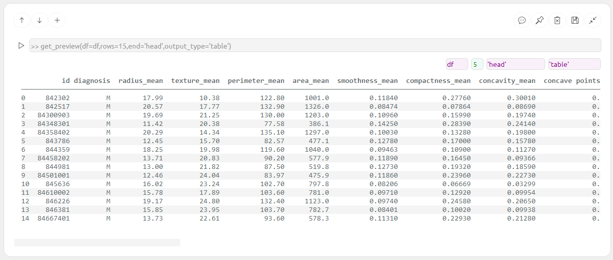
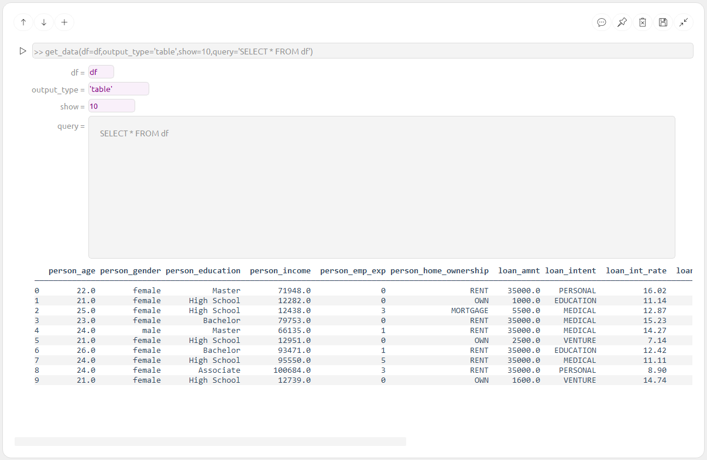
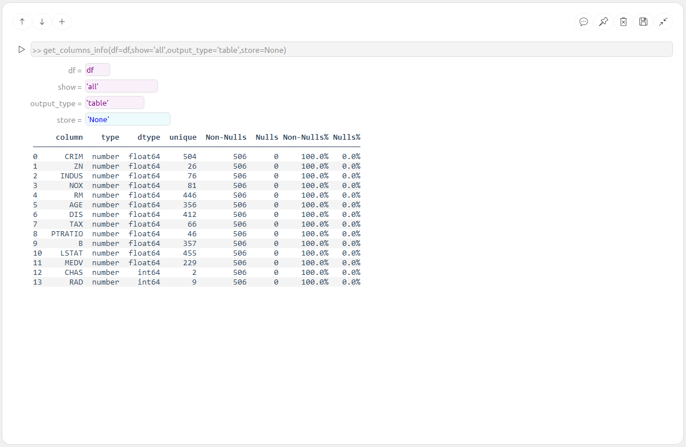
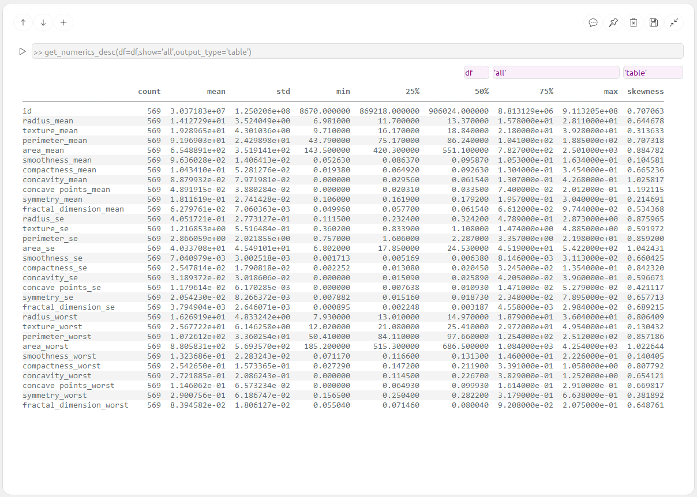
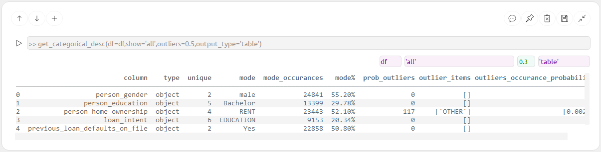
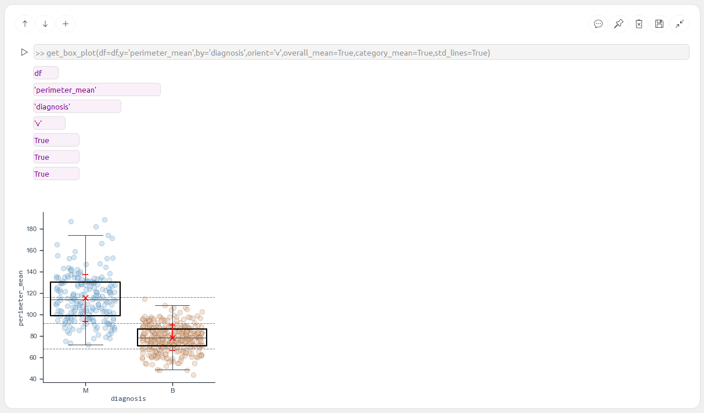
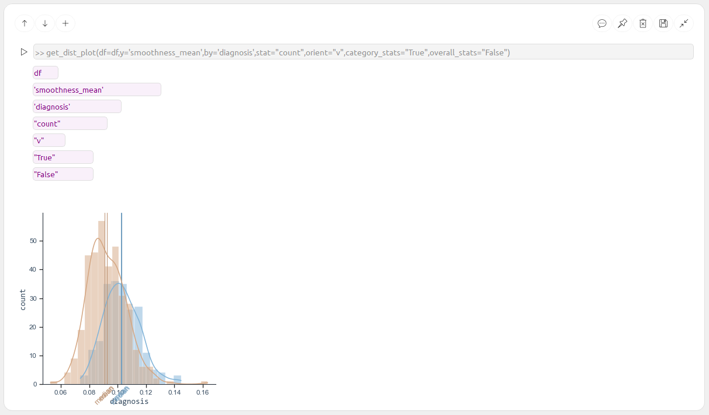
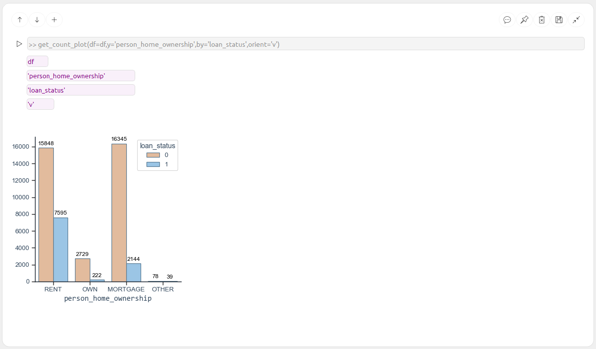

# Data_Explorer App

Simple & fast Data Exploration tool, it allows you to explore data along many files.  
App is built on simple "Command blocks" - each block contain an analysis which is a piece in the puzzle.  

Exploring the data is conducted via CommandBlocks from the following Tabs:  
**"Preview"/"Plots"/"Analysis"**.  
  
"Story" Tab is empty & will contain only saved CommandBlocks - it is used for presenting the final result.  

  
# Preview Tab blocks:
  
  
  
  
  

# SQL Tab blocks:
  

# Plots Tab blocks:
  
  
  
  

# Analysis Tab blocks:

