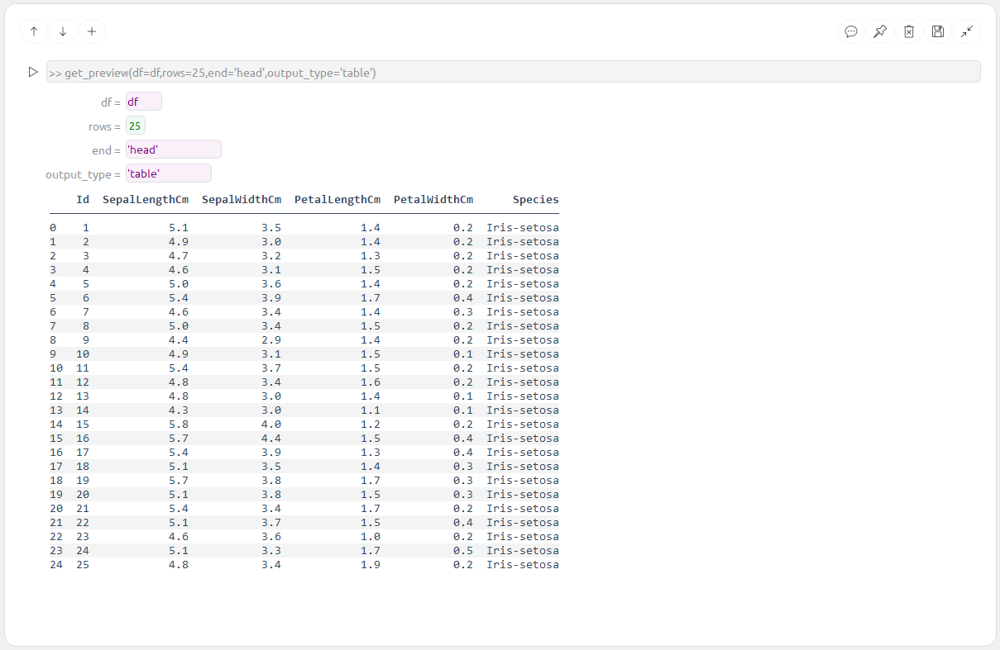
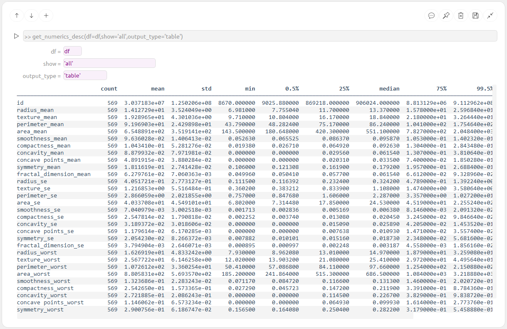

# Data Explorer App

**Data Explorer** is a simple and fast tool for exploring data across multiple files.  
It’s built around a modular concept of **Command Blocks** — each block performs a specific analysis, acting as a building block in your data exploration workflow.

The application is organized into several tabs that group different types of Command Blocks:

- **Preview**
- **Plots**
- **Analysis**
- **Story**

The **Story** tab is initially empty and serves as a place to save and organize selected Command Blocks. Use it to build and present your final insights.

---

## 🧭 Tabs Overview

---

## 📑 Table of Contents

- [📂 Preview Tab](#-preview-tab)
- [🧠 SQL Tab](#-sql-tab)
- [📊 Plots Tab](#-plots-tab)
- [📈 Analysis Tab](#-analysis-tab)

---

## 📂 Preview Tab

Quickly explore your dataset using the following blocks:

**Load and preview data**  

**Load data from file**  

**View column metadata**  

**Numeric summary statistics**  

**Categorical summary statistics**  

---

## 🧠 SQL Tab

Query data directly using SQL-style commands:

**SQL Data Loader**  

---

## 📊 Plots Tab

Visualize your data with a variety of plots:

**Box Plot**  

**Distribution Plot**  

**Count Plot (single feature)**  

**Count Plot (multiple features)**  

---

## 📈 Analysis Tab

This section will include advanced data analysis Command Blocks.  
*(Content coming soon)*

---
