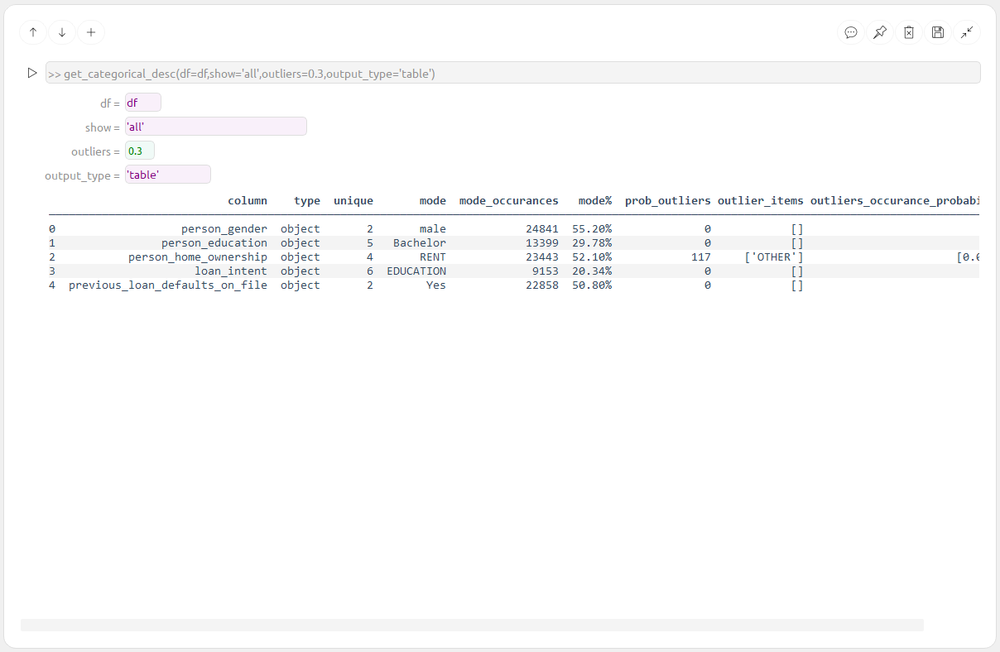
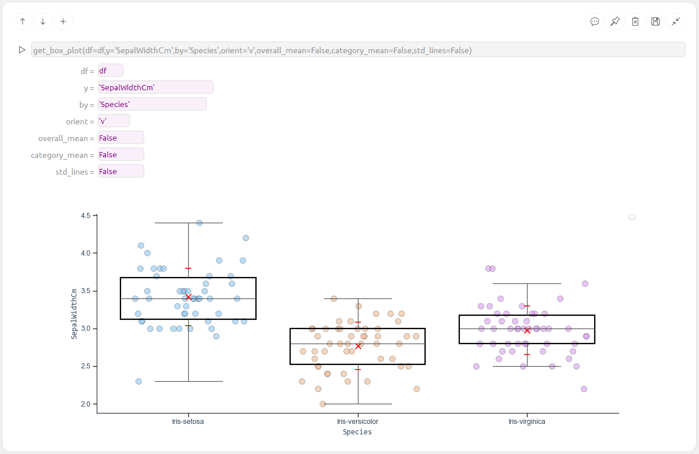
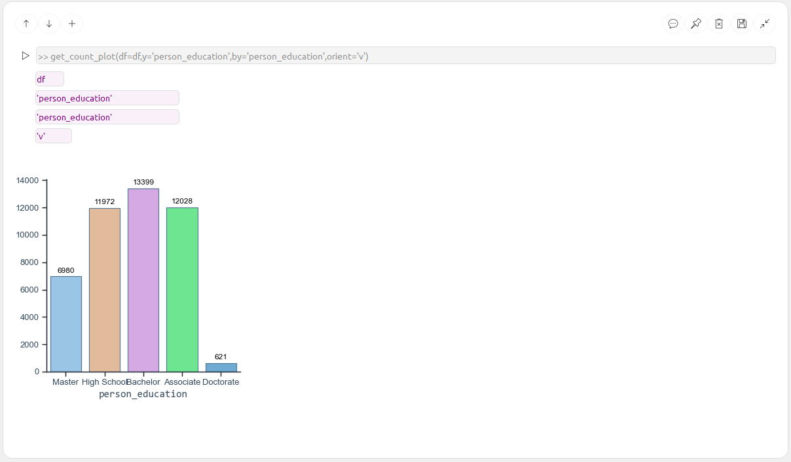

# Data Explorer App

**Data Explorer** is a simple and fast tool for exploring data across multiple files.  
It’s built around a modular concept of **Command Blocks** — each block performs a specific analysis, acting as a building block in your data exploration workflow.

The application is organized into several tabs that group different types of Command Blocks:

- **Preview**
- **Plots**
- **Analysis**
- **Story**

The **Story** tab is initially empty and serves as a place to save and organize selected Command Blocks. Use it to build and present your final insights.

---

## 📂 Preview Tab

Quickly explore your dataset using the following blocks:

| Description                    | Example                                      |
|-------------------------------|----------------------------------------------|
| Load and preview data         |   |
| Load data from file           |         |
| View column metadata          |  |
| Numeric summary statistics    |  |
| Categorical summary statistics|  |

---

## 🧠 SQL Tab

Query data directly using SQL-style commands:

| Block           | Example                              |
|-----------------|--------------------------------------|
| SQL Data Loader |  |

---

## 📊 Plots Tab

Visualize your data with a variety of plots:

| Plot Type                       | Example                                      |
|--------------------------------|----------------------------------------------|
| Box Plot                        |  |
| Distribution Plot              |  |
| Count Plot (single feature)     |  |
| Count Plot (multiple features)  |  |

---

## 📈 Analysis Tab

This section will include advanced data analysis Command Blocks.  
*(Content coming soon)*

---

# Data_Explorer App

Simple & fast Data Exploration tool, it allows you to explore data along many files.  
App is built on simple "Command blocks" - each block contain an analysis which is a piece in the puzzle.  

Exploring the data is conducted via CommandBlocks from the following Tabs:  
**"Preview"/"Plots"/"Analysis"**.  
  
"Story" Tab is empty & will contain only saved CommandBlocks - it is used for presenting the final result.  

  
# Preview Tab blocks:
  
  
  
  
  

# SQL Tab blocks:
  

# Plots Tab blocks:
  
  
  
  

# Analysis Tab blocks:

